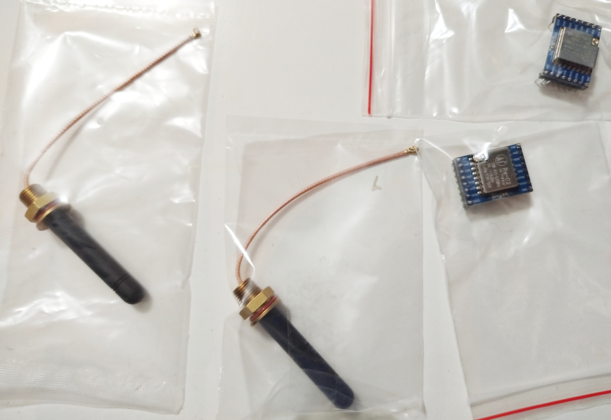
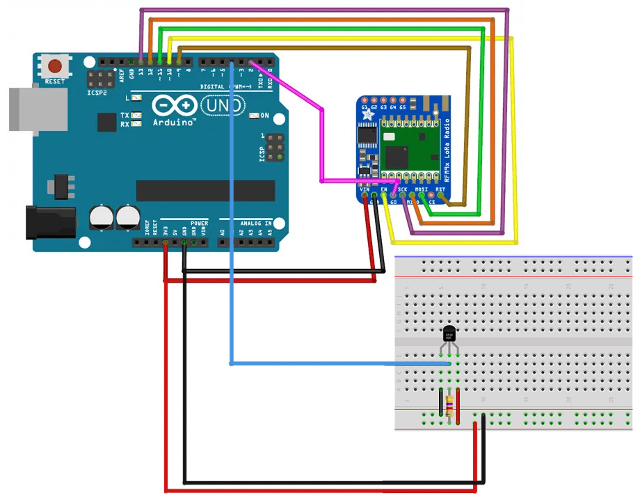

# 03 — LoRa SX1278 με DS18B20

📁 Φάκελος: `03_lora_module_with_ds18b20/`

---

## Α. Προεπισκόπηση

   
  <em>Ολοκλήρωση της κατασκευής στον Σύλλογο Τεχνολογίας Θράκης</em> 
  <em>Ομάδα Κατασκευής: Γιάννης Γ., Άρης Τ., Δημήτρης Κ.</em>

---

## Β. Περιγραφή

Ένα εκπαιδευτικό project ασύρματης τηλεμετρίας θερμοκρασίας με χρήση **LoRa SX1278** και αισθητήρα **DS18B20**.

Το σύστημα χωρίζεται σε δύο μέρη:
- **Transmitter:** διαβάζει τη θερμοκρασία από τον DS18B20 και τη στέλνει ασύρματα μέσω LoRa
- **Receiver:** λαμβάνει το πακέτο και το εμφανίζει στο Serial Monitor μαζί με την ισχύ σήματος (**RSSI**)

Η κατασκευή είναι ιδανική για εισαγωγή σε επικοινωνία μεγάλων αποστάσεων, αισθητήρες OneWire και βασική αρχιτεκτονική πομπού/δέκτη.

---

## Γ. Λειτουργίες

- Ανάγνωση θερμοκρασίας από αισθητήρα **DS18B20**
- Ασύρματη αποστολή δεδομένων μέσω **LoRa** στα **433 MHz**
- Λήψη και εμφάνιση μηνυμάτων σε δεύτερο Arduino
- Εμφάνιση ένδειξης ισχύος σήματος μέσω `LoRa.packetRssi()`
- Διαχωρισμός κώδικα σε **transmitter** και **receiver**

---

## Δ. Υλικά

- 2 x Arduino UNO
- 2 x LoRa modules **SX1278** (433 MHz)
- 1 x αισθητήρας θερμοκρασίας **DS18B20**
- 1 x αντίσταση **4.7kOhm** για pull-up στο DS18B20
- Καλώδια σύνδεσης
- 2 x κεραίες 433 MHz

---

## Ε. Προεπισκόπηση Υλικού

### LoRa Module SX1278 με κεραίες 434MHz 2dBi

  

---

## ΣΤ. Σχηματικό Διάγραμμα

  

---

## Ζ. Συνδεσμολογία

### LoRa SX1278 προς Arduino UNO

| LoRa SX1278 Module | Arduino UNO |
| :--- | :--- |
| **3.3V** | 3.3V |
| **GND** | GND |
| **EN/NSS** | D10 |
| **DIO0** | D2 |
| **SCK** | D13 |
| **MISO** | D12 |
| **MOSI** | D11 |
| **RST** | D9 |

### DS18B20 προς Arduino UNO (Transmitter)

- **VCC** → 5V
- **GND** → GND
- **DATA** → D4
- Αντίσταση **4.7kOhm** ανάμεσα σε **DATA** και **VCC**

> [!IMPORTANT]
> Το LoRa SX1278 λειτουργεί στα **3.3V**. Μην το τροφοδοτήσετε με **5V**.

---

## Η. Κώδικας

Τα sketches βρίσκονται στον φάκελο `src/`:

- `src/transmitter/transmitter.ino`
- `src/receiver/receiver.ino`

Ο transmitter:
- αρχικοποιεί τον αισθητήρα **DS18B20**
- διαβάζει τη θερμοκρασία
- στέλνει περιοδικά μήνυμα LoRa κάθε 5 δευτερόλεπτα

Ο receiver:
- ακούει για εισερχόμενα LoRa packets
- εμφανίζει το ληφθέν μήνυμα στο Serial Monitor
- εμφανίζει και την τιμή **RSSI** για βασικό έλεγχο σύνδεσης

---

## Θ. Εκτέλεση

1. Άνοιξε το `src/transmitter/transmitter.ino` και ανέβασέ το στο Arduino του πομπού.
2. Άνοιξε το `src/receiver/receiver.ino` και ανέβασέ το στο Arduino του δέκτη.
3. Εγκατέστησε τις βιβλιοθήκες:
- `LoRa`
- `OneWire`
- `DallasTemperature`
4. Σύνδεσε σωστά το module LoRa και στα δύο Arduino.
5. Σύνδεσε τον **DS18B20** μόνο στο Arduino του transmitter.
6. Άνοιξε το Serial Monitor του receiver για να δεις τα ληφθέντα δεδομένα.

---

## Ι. Εκπαιδευτικοί Στόχοι

- Εισαγωγή σε ασύρματη επικοινωνία **LoRa**
- Κατανόηση αρχιτεκτονικής **transmitter / receiver**
- Ανάγνωση δεδομένων από αισθητήρα **DS18B20**
- Χρήση διαύλου **SPI** για το LoRa module
- Εξοικείωση με βασική τηλεμετρία και έλεγχο σήματος

---

## Κ. Σημείωση

Το project μπορεί να αποτελέσει βάση για πιο σύνθετες IoT εφαρμογές, όπως απομακρυσμένη παρακολούθηση θερμοκρασίας σε θερμοκήπια, αποθήκες, εξωτερικούς χώρους ή εκπαιδευτικά δίκτυα αισθητήρων.
