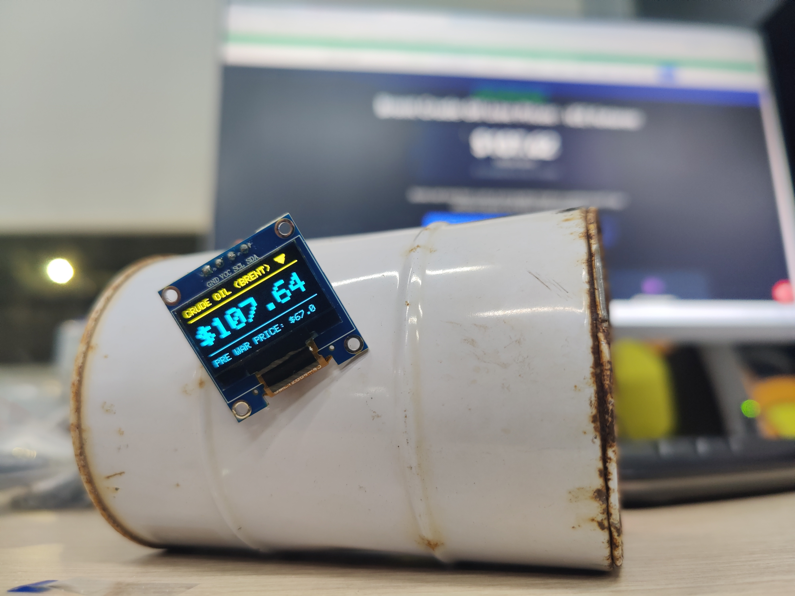

## Brent Crude Oil Live Tracker | ESP32 C3 Supermini

 
  <em>Ολοκλήρωση της κατασκευής στον Σύλλογο Τεχνολογίας Θράκης</em> 
  <em>Ομάδα Κατασκευής: Γιάννης Γ., Άρης Τ.</em>

🔍 ΤΙ ΚΑΝΕΙ:
Συνδέεται στο WiFi, αντλεί δεδομένα μέσω API και δείχνει στην οθόνη την τιμή και την τάση (ανοδική/καθοδική).

🌐 ΣΧΕΤΙΚΑ ΜΕ ΤΟ API:
Χρησιμοποιούμε ένα ανοιχτό API χωρίς Key, με περιορισμό στις πόσες κλήσεις μπορείς να κάνεις ανά μήνα. Προσοχή τα περισσότερα επαγγελματικά APIs που μπορούν να δεχθούν πιο συχνές κλίσεις απαιτούν συνδρομή και λειτουργούν με API keys. Υπάρχουν όμως και υπηρεσίες που προσφέρουν free tiers (με κλειδί).

🔋 ΤΡΟΦΟΔΟΣΙΑ:
Λειτουργεί με USB, αλλά μπορεί να γίνει πλήρως ασύρματο με προσθήκη μπαταρίας.

💻 SOFTWARE:
Χρησιμοποιεί βιβλιοθήκες όπως HTTPClient, ArduinoJSON και Adafruit. Η υποδομή είναι ευέλικτη: μπορείτε να καλέσετε οποιοδήποτε API ή και περισσότερα από ένα, εμείς απλά σας ανοίγουμε την όρεξη.

🛠️ HARDWARE:
• ESP32 C3 Supermini
• Screen OLED I2C

🔌 ΣΥΝΔΕΣΜΟΛΟΓΙΑ (Pins):
• Pin 8: SDA
• Pin 9: SCL
• GND: GND
• 3.3V: VCC

Youtybe Video:
https://www.youtube.com/watch?v=RXw2apjPLxI
