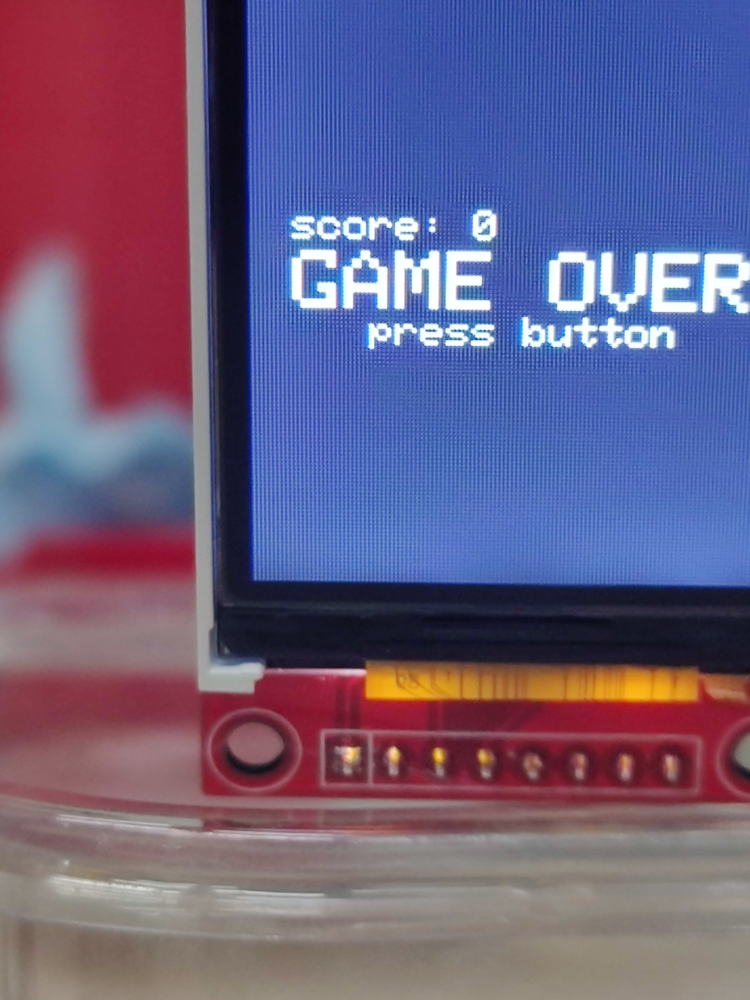
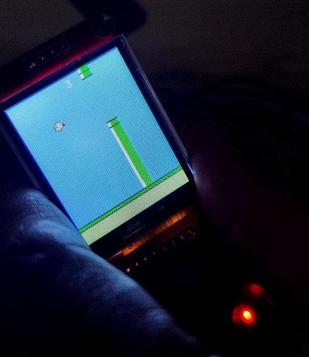

# Flapy Bird for Arduino Uno + 1.8" TFT ST7735

📁 Φάκελος: `05_flapy_bird_arduino/`

## Α. Προεπισκόπηση

  
  
  
  
   
  <em>Ολοκληρωμένη κατασκευή στον Σύλλογο Τεχνολογίας Θράκης</em>
   
  <em>Ομάδα Κατασκευής: Δημήτρης Κ., Γιάννης Γ., Άρης Τ.</em>

---

## Β. Περιγραφή

Προκειτε για ένα κλώνο του Flapy Bird σχεδιασμένο για να παίζει σε Arduino (ATmega328) σε μια οθόνη 1.8"
Original Repo: 
http://github.com/mrt-prodz/ATmega328-Flappy-Bird-Clone
http://mrt-prodz.com
by Themistokle "mrt-prodz" Benetatos

Η δική μας εκδοχή έχει απλά κάποιες μίκρ-οαλλαγες στην συνδεσμολογια του button.
---

## Γ. Λειτουργίες & Software

Χρησιμοποιει την βιβλιοθήκη Adafruit και SPI

---

## Δ. Υλικά (Hardware)

* **Arduino UNO**
* **ST7735 128x160 TFT display (SPI)**
* **Breadboard** 
* **10x Jumper Wires (Dupont F2F)**
* **Button**
* **🔋 Τροφοδοσία:** Μέσω USB (δυνατότητα για προσθήκη μπαταρίας για ασύρματη λειτουργία).

---

## Ε. Συνδεσμολογία (Pinout)

---
Arduino Uno + 1.8" TFT ST7735 No SD + Button (Pin Map)
---

D11 → MOSI
D13 → SCK
D10 → CS
D9  → DC
D8  → RST

5V   → VCC
3.3V → LED
GND  → GND

Simplified Button Connection (our modification)
D2 ── Button ──► GND

Original:
5V ──[10kΩ]──► D2
               │
               └── Button ──► GND

---