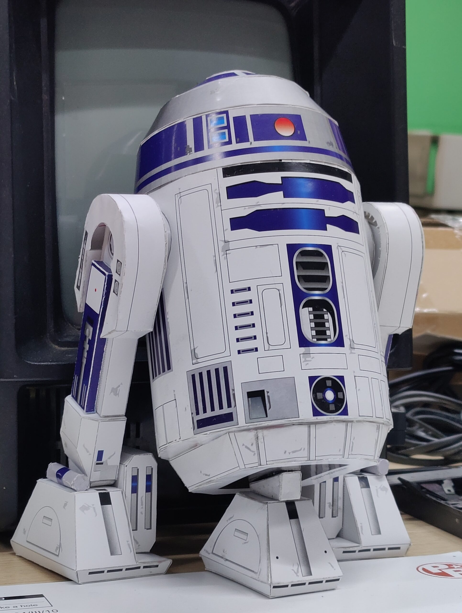
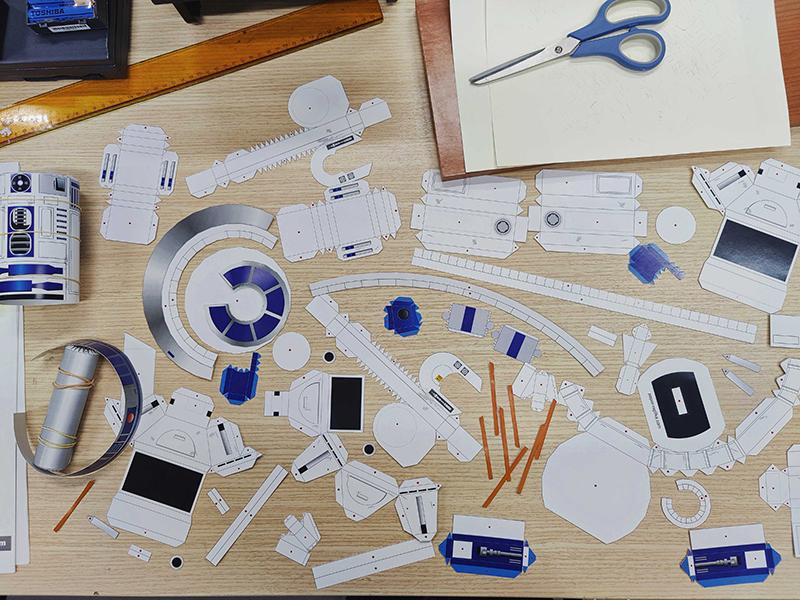

# R2inoD2ino - Robot with Voice Recognition/Mp3 Response / Papercraft Body

 
  <em>Ολοκλήρωση της κατασκευής στον Σύλλογο Τεχνολογίας Θράκης</em> 
  <em>Ομάδα Κατασκευής: Άρης Τ., Γιάννης Γ. Θεόδωρος Κ., Αστέρης Μ., Δούκας Π.</em>

Ένα εντυπωσιακό ρομπότ βασισμένο στο Arduino, το οποίο συνδυάζει την τέχνη του **papercraft** με τον αυτοματισμό. Το R2inoD2ino "ακούει" φωνητικές εντολές και αντιδρά με προηχογραφημένους ήχους, αλλά και κινήσεις κεφαλιού + LED φωτισμό.

## 🤖 Περιγραφή & Λειτουργία
Το project βασίζεται στον αισθητήρα **[DF Robot Voice Recognition Sensor](https://wiki.dfrobot.com/sen0539-en)** και το **DFPlayer Mini**.

* **Φωνητικός Έλεγχος:** Ο συγκεκριμένος αισθητήρας (voice recognition) υποστηρίζει έως και **17 custom commands** που ηχογραφούνται απευθείας στο module.
* **Λογική Απόκρισης:** Μόλις αναγνωριστεί ένα Command ID, ο κώδικας πυροδοτεί την αντίστοιχη ενέργεια (ήχο, κίνηση servo + οπτική ένδειξη) μέσω μιας δομής `switch case`.
* **Idle Mode:** Όταν το ρομπότ δεν δέχεται εντολές, παραμένει "ζωντανό" επιλέγοντας τυχαία ανάμεσα σε 15 διαφορετικούς ήχους 'αναμονής'.

## 🛠️ Υλικό (Hardware)
* **Micro Controller:** Arduino UNO (DFrduino)
* **Expansion Board:** Arduino Expansion Shield (για ευκολότερη συνδεσμολογία)
* **Voice Recognition Module:** DF Robot Voice Recognition Sensor
* **Audio:** DFPlayer Mini MP3 Player & Ηχείο 2W 8Ω
* **Storage:** Κάρτα Micro SD (FAT32)
* **Actuators:** 1x Typical Blue Servo (Κίνηση) & 1x Red LED (Οπτική ένδειξη)
* **Power:** Powerbank με Voltage Regulator (L7805CV - 5V 1.5A)
* **Chassis:** Σκελετός από ξύλο και εξωτερικό περίβλημα Papercraft.

## 📋 Οδηγίες Προετοιμασίας

### 1. Φωνητικές Εντολές
Ηχογραφήστε τις εντολές απευθείας στη μνήμη του Voice Recognition module της DF, ακολουθώντας τις οδηγίες του κατασκευαστή.
* Tip: Μην ηχογραφείτε τεράστια custom commands (ή ερωτήσεις), 4-5 λεξεις max (στα μεγάλα commands ηχογραφείτε μόνο η αρχή).
* Tip2: Φροντίστε όλα τα commands σας να διαφέρουν σημαντικά, μην κάνετε τα ίδια λάθη με εμάς: πχ αν έχετε ηχογραφήσει: 'Μπορείς να μου πεις ένα αστείο, μην ηχογραφήσετε άλλο command που ξεκινά με το "μπορείς να μου πεις" . 

### 2. Διαχείριση Αρχείων Ήχου
Οι προηχογραφημένες απαντήσεις σας (αυτές που θα γίνει το Robot) πρέπει να αποθηκευτούν σαν MP3s στην κάρτα SD με συγκεκριμένη ονοματολογία για να είναι προσβάσιμες από τον DFPlayer:
* `001.mp3`, `002.mp3` ... `xxx.mp3`
* Τα IDLE αρχεία, έχουν θέσεις 30 με 45.
* Τα delays θα πρέπει να οριστούν να είναι ελάχιστα μικρότερες από την διάρκεια του αρχείου σε ms
* Οι απαντήσεις μας είναι περισσότερες από τα commands καθώς σε κάποιες προστέθηκε τυχαιότητα (πχ ένα συγκεκριμένο command πυροδοτεί 6 τυχαίες απαντήσεις).
* Ο αισθητήρας έχει περίπου 100 build in commands (χρησιμοποιούμε πολύ λίγα από αυτά.. πχ το turn on the light για debug), καθώς θέλαμε να ακούει σε custom commands (πχ σε Ελληνικές ερωτήσεις),  

### 3. Κατασκευή Σώματος
* **Εξωτερικό:** Βασισμένο στο μοντέλο R2-D2 από το [Paper-Replika](https://paper-replika.com/index.php/star-wars/r2-d2-star-wars-papercraft) (Password: `paper-replika.com`).

 
  <em>Χειροτεχνία στον Σύλλογο Τεχνολογίας Θράκης</em> 

* **Εσωτερικό:** Χειροποίητος ξύλινος σκελετός για τη στήριξη των ηλεκτρονικών και των servo.

## 🎓 Εκπαιδευτικός Στόχος & Roadmap
Το project αυτό αποτελεί μια εξαιρετική σπουδή πάνω στους περιορισμούς της σειριακής εκτέλεσης κώδικα:
* **Current State:** Ο κώδικας εξαντλεί τις δυνατότητες της συνάρτησης `delay()`, προσφέροντας μια απλή αλλά αποτελεσματική αλληλουχία κινήσεων και ήχων.
* **Next Step:** Πλήρης ανακατασκευή του κώδικα με χρήση της συνάρτησης `millis()` (non-blocking code). Στόχος είναι η επίδειξη του "ψευδο-παραλληλισμού", επιτρέποντας στο ρομπότ να κινείται και να μιλάει ταυτόχρονα χωρίς να "παγώνει" η εκτέλεση.

---
*Περισσότερες λεπτομέρειες για το κύκλωμα και τη διαδικασία κατασκευής θα προστεθούν σύντομα.*
