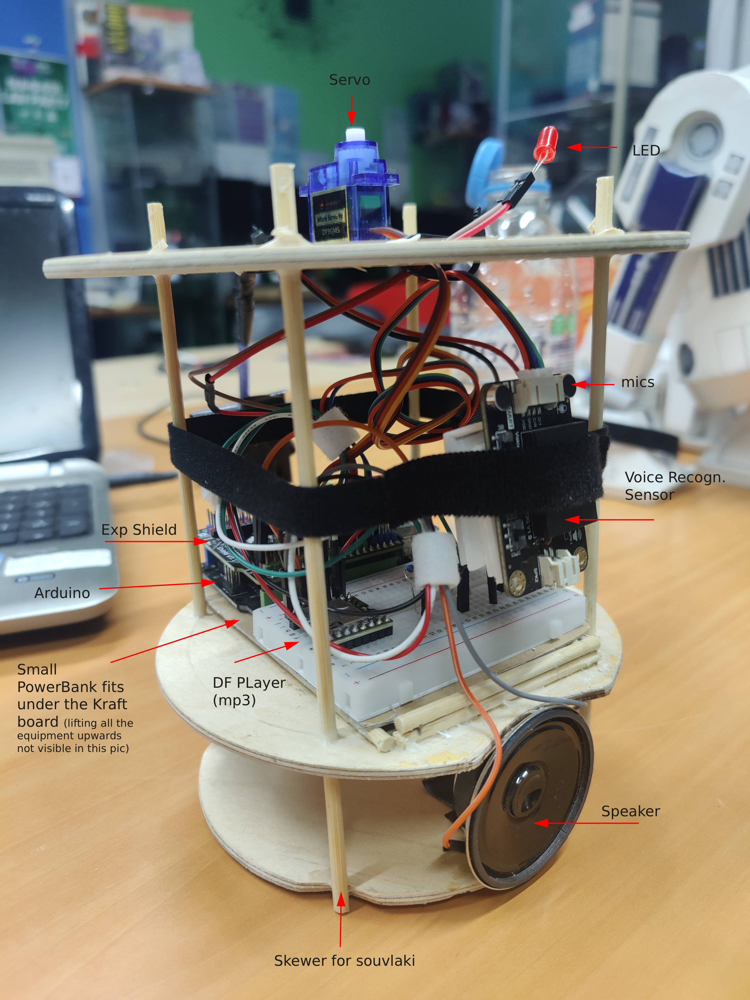

# R2inoD2ino - Robot with Voice Recognition & Papercraft Body

📁 Φάκελος: `06_R2inoD2ino/`

---

## Α. Προεπισκόπηση

  
   
  <em>Ολοκλήρωση της κατασκευής στον Σύλλογο Τεχνολογίας Θράκης</em>
   
  <em>Ομάδα Κατασκευής: Άρης Τ., Γιάννης Γ. Θεόδωρος Κ., Αστέρης Μ., Δούκας Π.</em>

---

## Β. Περιγραφή

Ένα εντυπωσιακό ρομπότ βασισμένο στο Arduino, το οποίο συνδυάζει την τέχνη του **papercraft** με τον αυτοματισμό. Το R2inoD2ino "ακούει" φωνητικές εντολές και αντιδρά με προηχογραφημένους ήχους, κινήσεις κεφαλιού και LED φωτισμό.

---

## Γ. Λειτουργίες

* **🤖 Φωνητικός Έλεγχος:** Υποστήριξη έως και 17 custom φωνητικών εντολών.
* **🎭 Λογική Απόκρισης:** Χρήση δομής `switch case` για πυροδότηση ενεργειών (ήχος + κίνηση servo + LED).
* **💤 Idle Mode:** Τυχαία επιλογή ανάμεσα σε 15 ήχους αναμονής".
* **📦 Body:** Εξωτερικό περίβλημα από χαρτόνι (Papercraft), εσωτερική ενίσχυση με depron, ξύλινος σκελετός(για το H/W στο εσωτερικό).

---

## Δ. Υλικά (Hardware)

* **Micro Controller:** Arduino UNO (DFrduino)
* **Expansion Board:** Arduino Expansion Shield
* **Voice Recognition:** [DF Robot Voice Recognition Sensor](https://wiki.dfrobot.com/sen0539-en)
* **Audio:** DFPlayer Mini MP3 & Ηχείο 2W 8Ω
* **Actuators:** 1x Typical Blue Servo & 1x Red LED
* **Power:** Powerbank με Voltage Regulator (L7805CV - 5V 1.5A)

---

## Ε. Οδηγίες Προετοιμασίας

### 1. Φωνητικές Εντολές
Ηχογραφήστε τις εντολές απευθείας στη μνήμη του module.
> [!TIP]
> * Μην ηχογραφείτε μεγάλες προτάσεις (4-5 λέξεις max).
> * Φροντίστε οι εντολές να διαφέρουν σημαντικά μεταξύ τους (π.χ. μην ξεκινάτε πολλές εντολές με τις ίδιες λέξεις).

### 2. Διαχείριση Αρχείων Ήχου
Τα MP3s στην κάρτα SD πρέπει να έχουν τη μορφή `001.mp3`, `002.mp3` κλπ.
* **Θέσεις 30-45:** Αρχεία για το Idle Mode.
* **Randomness:** Ορισμένες εντολές πυροδοτούν τυχαία επιλογή από μια ομάδα απαντήσεων για ποικιλία.

---

## ΣΤ. Κατασκευή Σώματος

* **Εξωτερικό:** Βασισμένο στο μοντέλο R2-D2 από το [Paper-Replika](https://paper-replika.com/index.php/star-wars/r2-d2-star-wars-papercraft).

  
   
  <em>Φάση χειροτεχνίας στον Σύλλογο Τεχνολογίας Θράκης</em>

* **Εσωτερικό:** Χειροποίητος ξύλινος σκελετός για στήριξη του Hardware στο εσωτερικό του robot.

  
   
  <em>Ο ξύλινος σκελετός μαζι με το hardware τοποθετήτε αφαιρόντας το κεφαλι, τα επίπεδα πατάνε σε εσωτερική 'πατούρα' / κυκλική προεξοχή φτιαγμένη με Depron</em>

---

## Ζ. 🔌 Καλωδίωση / Pinmap

### 📋 Συνοπτικός Πίνακας

| Component        | Pin / Σήμα | Arduino | Σχόλιο |
|------------------|-----------|---------|--------|
| LED              | +         | D13     | |
| LED              | −         | GND     | με αντίσταση 220–330Ω |
| Servo            | Signal    | D6      | |
| Servo            | VCC       | 5V      | |
| Servo            | GND       | GND     | |
| Voice Sensor     | D/T       | SDA (A4)| |
| Voice Sensor     | C/R       | SCL (A5)| |
| Voice Sensor     | VCC       | 5V      | |
| Voice Sensor     | GND       | GND     | |
| DFPlayer         | RX        | D11     | μέσω ~1kΩ |
| DFPlayer         | TX        | D10     | μέσω ~1kΩ |
| DFPlayer         | VCC       | 5V      | |
| DFPlayer         | GND       | GND     | |
| DFPlayer         | SPK1      | Speaker | |
| DFPlayer         | SPK2      | Speaker | |

---

### 🔋 Τροφοδοσία (Powerbank 5V, ≥2–3A)

| Σύνδεση | Περιγραφή |
|--------|----------|
| +5V → SERVO PWR (+) | Το κόκκινο καλώδιο από το powerbank πηγαινει στην πράσινη κλέμα στο shield |
| ↳ +5V → Arduino USB | επέκταση ίδιας γραμμής (και κόληση στο USB) |
| GND → SERVO PWR (−) | κοινή γείωση |

---

### ⚡ Σημειώσεις
- Όλα τα components μοιράζονται **κοινό GND** από το D rail του shield
- Όλα τα components τροφοδοτούνται από το ίδιο **VCC (5V rail)** από το D rail του shield
- ⚠️ Προσοχή: αν δοθεί τροφοδοσία μόνο στο SERVO PWR, τροφοδοτείται **μόνο το D rail** (όχι το Arduino)
- Το shield 7.1 της DF διαθέτει D rail με κοινό VCC και GND — ιδανικό για τριπλέτες (π.χ. servo)

---

## Η. Εκπαιδευτικοί Στόχοι & Roadmap

* **Serial Execution:** Κατανόηση των περιορισμών του σειριακού τρόπου εκτέλεσης (`delay()`).
* **Εισαγωγή στη `millis()`:** Χρήση της για υλοποίηση IDLE MODE χωρίς blocking.
* **Next Step:** Ανακατασκευή του κώδικα με `millis()` (non-blocking) για ταυτόχρονη κίνηση και αναπαραγωγή ήχου.

---