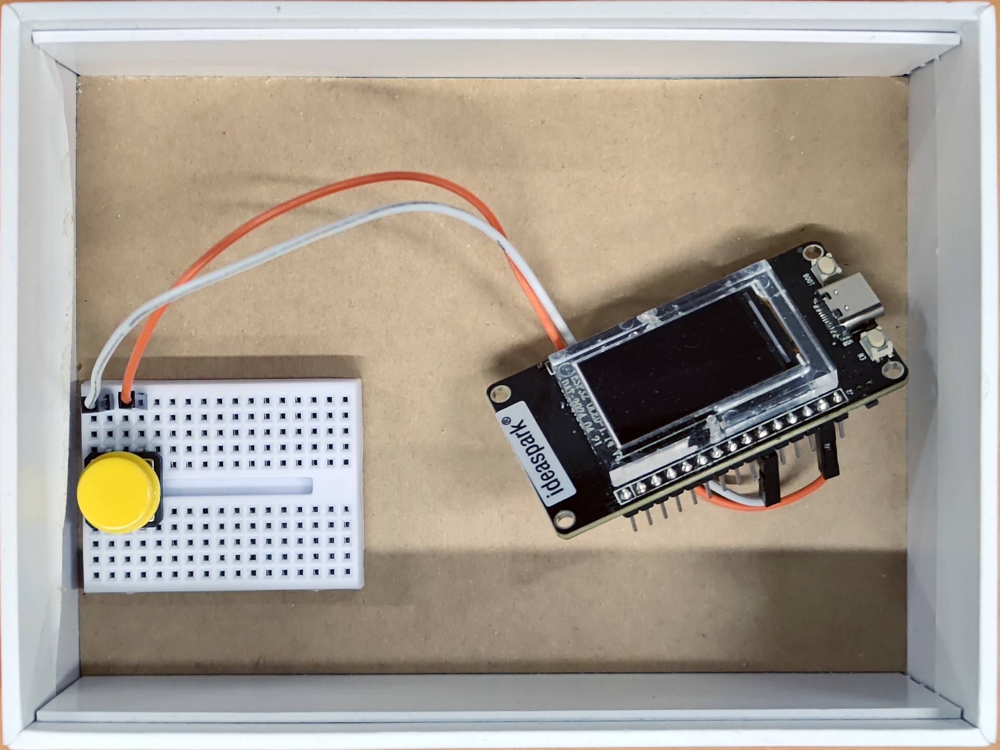
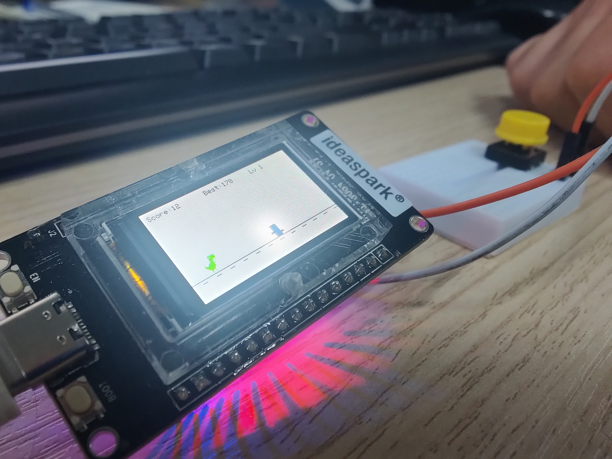

# Dino Game (Chrome Offline) - ESP

📁 Φάκελος: `07_dino_game_ESP/`

## Α. Προεπισκόπηση

  
  
   
  <em>Ολοκληρωμένη κατασκευή στον Σύλλογο Τεχνολογίας Θράκης</em>
   
  <em>Ομάδα Κατασκευής: Δημήτρης Κ., Γιάννης Γ., Άρης Τ.</em>

---

## Β. Περιγραφή
Πρόκειται για έναν απλοποιημένο κλώνο του δημοφιλούς παιχνιδιού με τον **Dino Run** της Google που εμφανίζεται στον Chrome όταν δεν έχουμε internet, χρησιμοποιούμε ESP Ideaspark με ενσωματωμένη οθόνη.

## Γ. Λειτουργίες & Software
Εγκαταστήστε της απαραίτητες βιβλιοθήκες:
* `#include <Adafruit_GFX.h>`
* `#include <Adafruit_ST7789.h>`

Τοποθετήστε το `Dino.ino` σε ομόνυμο κατάλογο μαζί με τις 2 βιβλιοθήκες (headers) `gameover.h` και `noInternet.h`.

## Δ. Υλικά (Hardware)
Για την κατασκευή θα χρειαστείτε:
* **1x ESP Ideaskpark** (με ενσωματωμένη οθόνη TFT ST7789)
* **1x Breadboard (Optional)**
* **2x Jumper Wires (Dupont)**
* **1x Push Button**
* **🔋 Τροφοδοσία:** Μέσω USB (δυνατότητα για προσθήκη μπαταρίας 9V για φορητότητα).

## Ε. Συνδεσμολογία (Pinout)

| Pin ESP | Εξάρτημα |
| :--- | :--- |
| **27** | Button Pin A |
| **GND** | Button Pin B |

*Σημείωση: Η οθόνη ST7789 είναι προ-συνδεδεμένη εσωτερικά στην πλακέτα Ideaspark.*

## 🚀 Οδηγίες Χρήσης
1. Πραγματοποιήστε την super εύκολη συνδεσμολογία συνδέοντας το Button στο Pin 27 και στη γείωση (GND).
2. Ανοίξτε το αρχείο `Dino.ino` στο Arduino IDE.
3. Επιλέξτε την σωστή θύρα (Port) και το board **ESP32 Dev Module**.
4. Πατήστε **Upload** και είστε έτοιμοι!

## 📺 Δείτε το σε δράση

*Κάντε κλικ στην εικόνα για να δείτε το βίντεο στο YouTube.*

---

> [!WARNING]
> **Work In Progress (WIP) & Known Issues**
> Το project βρίσκεται υπό ανάπτυξη. 
> * **Night Mode Issue:** Κατά την εναλλαγή σε night mode, ο δινόσαυρος ενδέχεται να εμφανίζεται με λευκό περίβλημα (halo effect).

---
**Technology Club of Thrace** *Exploring Technology through Code & Circuits*