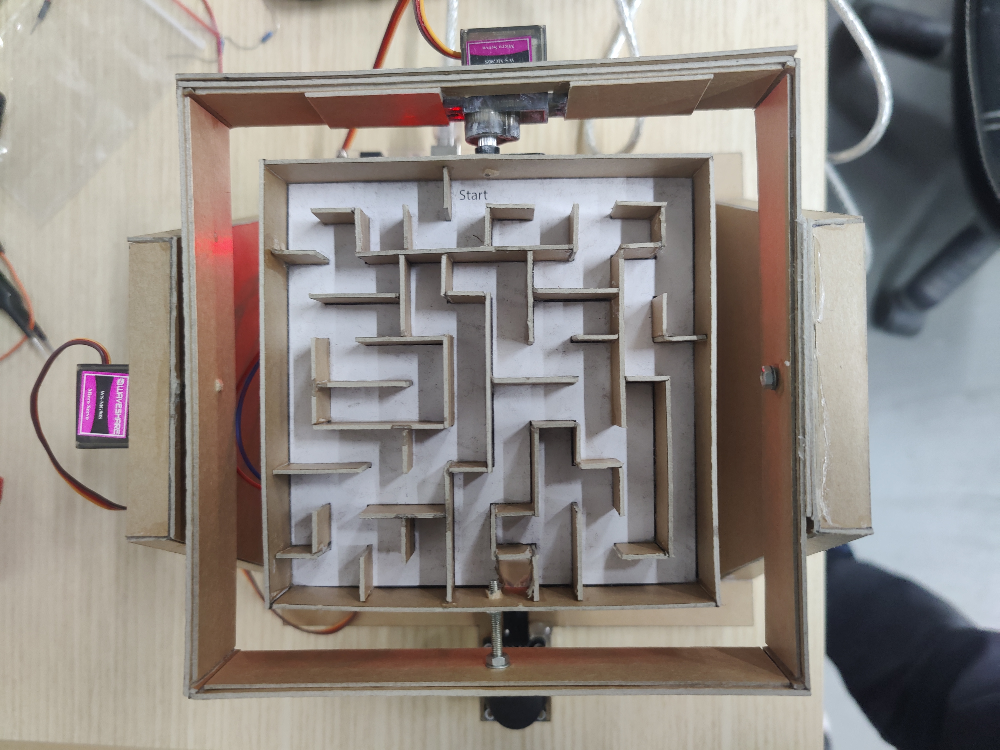
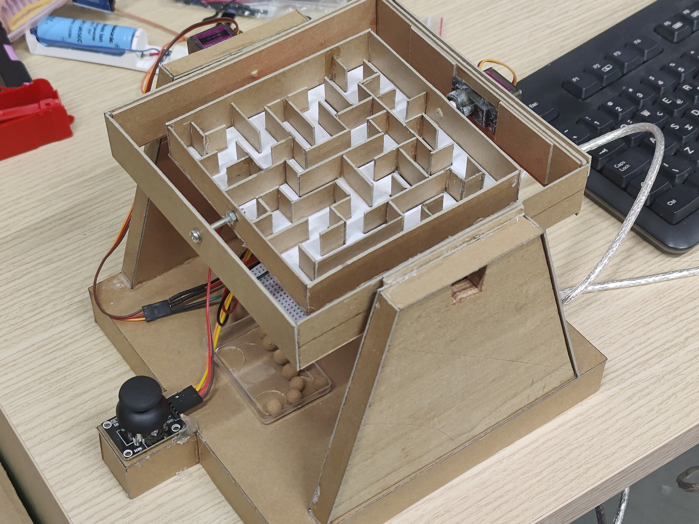

# Λαβύρινθος Βαρύτητας 2 Αξόνων

📁 Φάκελος: `08_Gravity_Maze/`

## Α. Προεπισκόπηση

  
  
   
  <em>Ολοκληρωμένη κατασκευή στον Σύλλογο Τεχνολογίας Θράκης</em>
   
  <em>Ομάδα Κατασκευής: Κοσμίδης Θ., Δημήτρης Κ., Γιάννης Γ.</em>

---

## Β. Περιγραφή & Καινοτομίες
Σε αυτό το πείραμα, κατασκευάζουμε έναν μηχανισμό 2 αξόνων (Gimbal) που φιλοξενεί έναν λαβύρινθο. Ο χρήστης ελέγχει την κλίση της πλατφόρμας μέσω ενός Joystick. 

Σε αντίθεση με τις απλές υλοποιήσεις, ο κώδικας `bilia.ino` που αναπτύχθηκε στο σύλλογο εισάγει προηγμένες τεχνικές ελέγχου κίνησης:
* **Dynamic Easing & Slew-Rate:** Η κίνηση δεν είναι απότομη· το σύστημα επιβραδύνει καθώς πλησιάζει στον στόχο, δίνοντας μια οργανική και ρεαλιστική αίσθηση βαρύτητας.
* **Exponential Mapping (Expo 1.6):** Προσφέρει εξαιρετική ακρίβεια στις μικρές κινήσεις γύρω από το κέντρο, επιτρέποντας στον παίκτη να κάνει διορθώσεις ακριβείας.
* **Signal Filtering:** Χρήση **Low-Pass Filter** και δειγματοληψίας 15 σημείων για την πλήρη εξάλειψη του τρεμουλιάσματος (jitter) των Servo.
* **Auto-Calibration:** Αυτόματος εντοπισμός του κέντρου του Joystick κατά την εκκίνηση για τέλεια ισορροπία κάθε φορά.

## Γ. Υλικά (Hardware)
Για την υλοποίηση απαιτούνται:
* **1x** Arduino Nano ή Uno
* **2x** Servo Motors (π.χ. SG90 ή MG90S)
* **1x** Joystick Module (Analog 2-axis)
* **1x** Χαρτόνι Kraft χοντρό 800(g/m²), για την κατασκευή του λαβυρίνθου και του πλαισίου.
* **Καλώδια σύνδεσης** (Jumper wires)

## Δ. Συνδεσμολογία (Pinout)

| Εξάρτημα | Pin | Arduino Pin | Περιγραφή |
| :--- | :--- | :--- | :--- |
| **Servo X** | Signal | **D8** | Έλεγχος Οριζόντιου Άξονα |
| **Servo Y** | Signal | **D9** | Έλεγχος Κάθετου Άξονα |
| **Joystick** | VRx | **A0** | Αναλογική Είσοδος Άξονα X |
| **Joystick** | VRy | **A1** | Αναλογική Είσοδος Άξονα Y |
| **Τροφοδοσία** | VCC / 5V | **5V** | Κοινή γραμμή τροφοδοσίας |
| **Γείωση** | GND | **GND** | Κοινή γείωση συστήματος |

## Ε. Οδηγίες Χρήσης & Ρυθμίσεις
1. **Εκκίνηση:** Κατά την τροφοδοσία, αφήστε το Joystick ελεύθερο για τη βαθμονόμηση των αξόνων.
2. **Χειρισμός:** Η πλατφόρμα ακολουθεί την κίνηση του Joystick με μέγιστη κλίση **±20 μοίρες** (X Home: 130°, Y Home: 70°).
3. **Smart Power:** Τα Servo απενεργοποιούνται (detach) αυτόματα μετά από 2 δευτερόλεπτα ακινησίας για μείωση του θορύβου και προστασία των κινητήρων.

## ΣΤ. Εκπαιδευτική Αξία
Το project αποτελεί ιδανική εισαγωγή στις έννοιες του **ελέγχου κίνησης (motion control)** και της **επεξεργασίας σήματος**. Οι μαθητές μαθαίνουν πώς να μετατρέπουν αναλογικά δεδομένα σε ομαλή φυσική κίνηση, κατανοώντας τη σημασία των αλγορίθμων στη βελτίωση της εμπειρίας του χρήστη (UX).

## Ζ. Credits & Αναφορές
* **Αρχική Ιδέα:** Το project βασίστηκε στην κατασκευή [Arduino Marble Maze Labyrinth](https://www.instructables.com/Arduino-Marble-Maze-Labyrinth/) του **Ahmed Azouz** ([ahmedazouz](https://www.instructables.com/member/ahmedazouz/)) . Εκεί μπορείτε να βρειτε και ένα PDF που περιγράφει την κατασκευή του λαβυρίνθου με απλό χαρτόνι. Αλλά και την συνδεσμολογία του hardware σε εικόνα!
* **Ανάπτυξη & Βελτιστοποίηση:** Ο επανασχεδιασμός του κώδικα με αλγορίθμους εξομάλυνσης και η μηχανική υλοποίηση έγινε από την ομάδα του **Συλλόγου Τεχνολογίας Θράκης**.
* Η **βελτίωση της κατασκευής:** έγινε από τον Κοσμίδη Θ. του **Συλλόγου Τεχνολογίας Θράκης**.

---
**Technology Club of Thrace** *Code and Circuits Experiments*