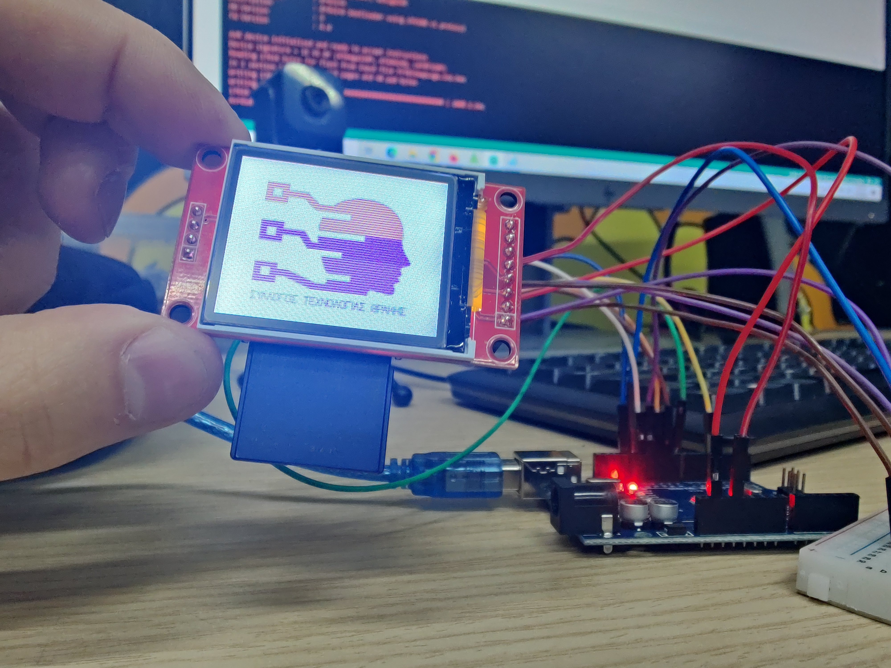

# 📂 10_Slide_Show_Stream

  
   
  <em>Ολοκλήρωση της κατασκευής στον Σύλλογο Τεχνολογίας Θράκης</em>
   
  <em>Ομάδα Κατασκευής: Άρης Τ., Δημήτρης Κ., Γιάννης Γ.</em>

---

### 📋 Περιγραφή
Αυτό το project υλοποιεί ένα δυναμικό **Slideshow** σε οθόνη TFT, διαβάζοντας εικόνες απευθείας από μια κάρτα SD. Σε αντίθεση με απλές μεθόδους, ο κώδικας χρησιμοποιεί **low-level streaming**, διαβάζοντας τα δεδομένα pixel-προς-pixel από το αρχείο BMP για την ελαχιστοποίηση της χρήσης μνήμης RAM. Η μέθοδος αυτή επιτρέπει να προβάλλουμε απεριόριστο αριθμό εικόνων χωρίς να εξαντλούνται οι πόροι του μικροελεγκτή.

Το πρόγραμμα αναζητά αρχεία εικόνας με την ονομασία `001.BMP`, `002.BMP`, κ.λπ., στην κάρτα SD. Για κάθε εικόνα, αναλύει το header του αρχείου, εξάγει τις διαστάσεις (πλάτος και ύψος) και το σημείο έναρξης των δεδομένων (pixel offset). Στη συνέχεια, μετατρέπει το χρώμα από 24-bit (RGB) σε 16-bit (565 format) και το σχεδιάζει απευθείας στην οθόνη.

---

### 🛠️ Υλικά (Hardware)
Για την κατασκευή θα χρειαστείτε:
* **1x Arduino UNO**
* **1x ST7735 128x160 TFT display (με υποδοχή SD)**
* **1x SD Card (έως 2GB):** Προτείνεται η χρήση απλών καρτών SD (FAT16/FAT32). Οι νεότερες κάρτες τύπου **SDHC** ενδέχεται να παρουσιάσουν σφάλματα αρχικοποίησης (Initialization Fail).
* **1x Breadboard**
* **~15x Jumper Wires (Dupont)**
* **🔋 Τροφοδοσία:** Μέσω USB (δυνατότητα για προσθήκη μπαταρίας 9V για φορητότητα).

---

### 📍 Pin Map (Arduino Uno)

| Arduino Pin | Εξάρτημα / Pin | Λειτουργία |
| :--- | :--- | :--- |
| **11** | SDA (TFT) + SD_MOSI | SPI Data (Shared) |
| **12** | SD_MISO | SD Data Out |
| **13** | SCK (TFT) + SD_SCK | SPI Clock (Shared) |
| **10** | CS (TFT) | Chip Select Οθόνης |
| **4** | SD_CS | Chip Select SD Card |
| **9** | A0 / DC | Data/Command Control |
| **8** | RESET | Hardware Reset |
| **5V** | VCC | Τροφοδοσία |
| **5V** | LED | Backlight (Απαραίτητο) |
| **GND** | GND | Γείωση |

---

### ⚙️ Λογική Λειτουργίας (Logic Diagram)

1. **Άνοιγμα Αρχείου:** Προσπάθεια ανάγνωσης του BMP αρχείου από την SD.
2. **Έλεγχος Header:** Επιβεβαίωση εγκυρότητας αρχείου (BMP signature 'BM').
3. **Ανάγνωση Δεδομένων:** Εξαγωγή του offset των pixels και των διαστάσεων της εικόνας.
4. **Streaming & Μετατροπή:** * Ανάγνωση των χρωμάτων B, G, R.
    * Μετατροπή σε 16-bit 565 format.
    * Σχεδίαση του pixel στην οθόνη μέσω της `pushColor()`.
5. **Επανάληψη:** Κλείσιμο αρχείου και μετάβαση στην επόμενη εικόνα.

---

### ⚠️ Σημειώσεις
* **Μορφή Εικόνων:** Οι εικόνες πρέπει να είναι αποθηκευμένες ως **24-bit BMP**.
* **Backlight:** Το pin **LED** της οθόνης ΠΡΕΠΕΙ να είναι συνδεδεμένο στα 5V, αλλιώς η οθόνη θα φαίνεται μαύρη.
* **SDHC Κάρτες:** Για μεγάλες κάρτες (π.χ. 14GB+), προτείνεται η χρήση της βιβλιοθήκης `SdFat.h`.
* **Ταχύτητα:** Η εναλλαγή των εικόνων έχει καθυστέρηση 500ms (ρυθμιζόμενο στον κώδικα).

---

### 📚 Απαραίτητες Βιβλιοθήκες
* `SPI.h`
* `SD.h`
* `TFT.h`

---

### 🎓 Εκπαιδευτική Αξία
Το συγκεκριμένο πείραμα αποτελεί μια εξαιρετική εισαγωγή στη διαχείριση αρχείων και data streaming. Προτείνεται να πραγματοποιείται ως συνέχεια απλούστερων μεθόδων που εξαντλούν τη μνήμη RAM. Οι μαθητές έρχονται σε επαφή με:
* **Δομή Αρχείων (File Headers):** Κατανόηση του πώς ένας υπολογιστής αναγνωρίζει έναν τύπο αρχείου (BMP) διαβάζοντας τα πρώτα bytes.
* **Χρωματικά Μοντέλα:** Τη μετατροπή από το πρότυπο 24-bit RGB στο 16-bit 565 format που απαιτούν οι μικροελεγκτές.
* **Διαχείριση Μνήμης:** Πώς μπορούμε να εμφανίσουμε πολλές ή μεγάλες εικόνες χωρίς να τις φορτώσουμε ολόκληρες στη μνήμη RAM του Arduino, επεξεργάζοντάς τες σε "ροή".