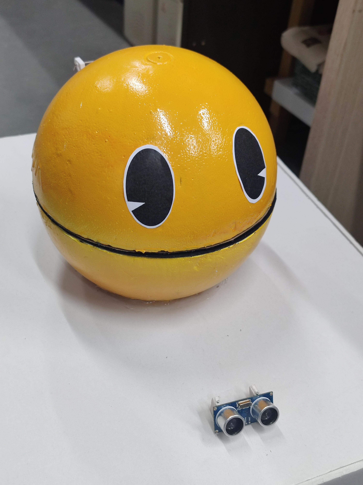
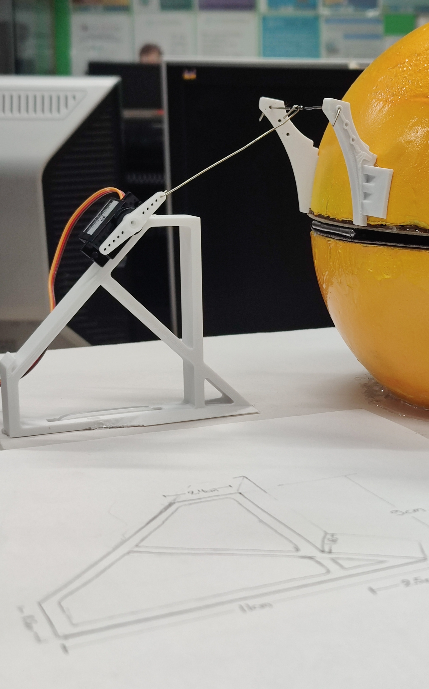
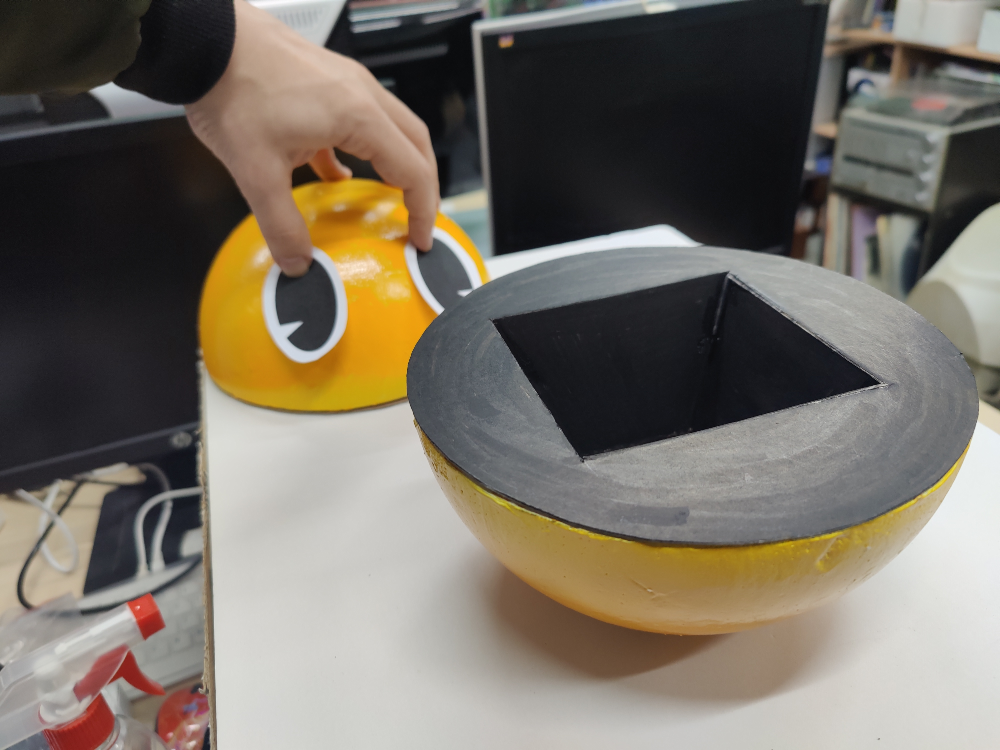
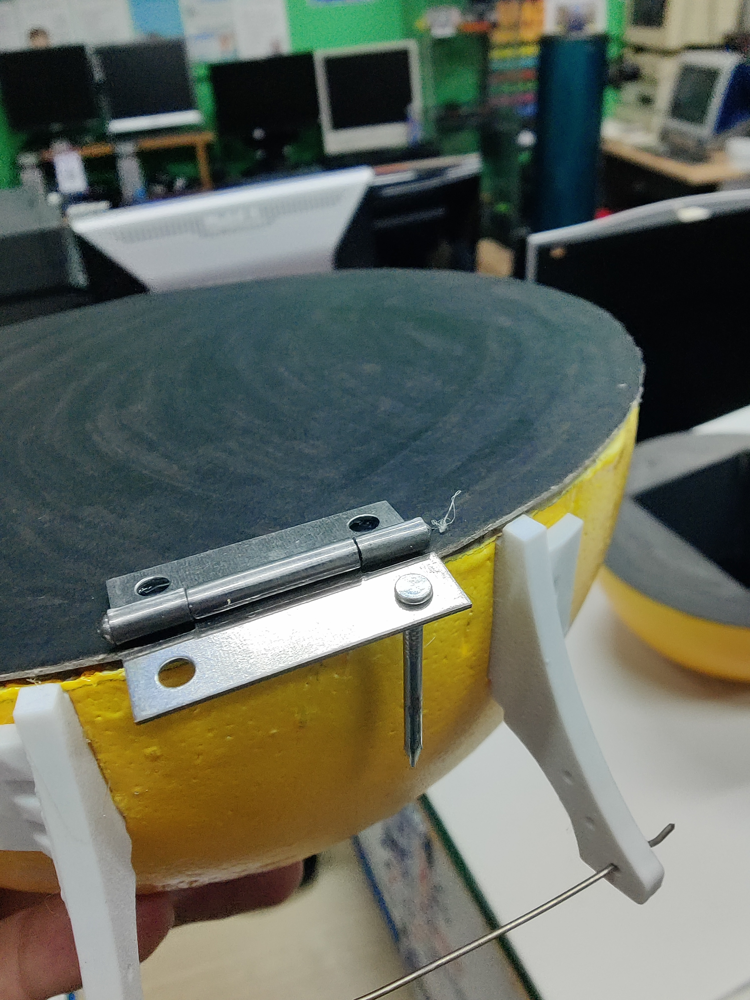

# Pacman Piggy Bank - Arduino Nano 🪙👾

📁 **Φάκελος:** `11_pacman_piggybank/`

## Α. Προεπισκόπηση

  
  
   
  <em>Ολοκληρωμένη κατασκευή στον Σύλλογο Τεχνολογίας Θράκης</em>
   
  <em>Ομάδα Κατασκευής: Άρης Τ., Γιάννης Γ., Γιάννης Μ., Τάσος Δ.</em>

---

## Β. Περιγραφή
Πρόκειται για έναν διαδραστικό κουμπαρά Pacman που "ζωντανεύει" όταν πλησιάζεις. Το σύστημα χρησιμοποιεί έναν αισθητήρα υπερήχων για να ανιχνεύσει προσέγγιση σε απόσταση μικρότερη των 50cm. Μόλις ανιχνευτεί κίνηση, το στόμα ανοίγει αυτόματα με έναν Servo κινητήρα, παραμένει ανοιχτό για 2.5 δευτερόλεπτα μετά την απομάκρυνση του αντικειμένου και στη συνέχεια κλείνει. Το κεφάλι είναι στερεωμένο σε ένα iso box με φελιζόλ και έχει επενδυθεί με επιπλέον χαρτί χειροτεχνίας.

## Γ. Λειτουργίες & Software
Για τη λειτουργία του κώδικα απαιτείται η βιβλιοθήκη:
* `#include <Servo.h>`

**Ρυθμίσεις Κώδικα:**
* **Απόσταση ενεργοποίησης:** 50cm.
* **Χρόνος αναμονής:** 2500ms (2.5 δευτερόλεπτα).
* **Γωνίες Servo:** 10° (Κλειστό) έως 170° (Ανοιχτό).
* **Interval μέτρησης:** Κάθε 400ms.

## Δ. Υλικά (Hardware & Κατασκευή)
### Ηλεκτρονικά
* **Arduino Nano**
* **Ultrasonic Sensor (HC-SR04)**
* **Servo Motor (SG90)**
* **Jumper Wires** (Dupont Cables)
* **🔋 Τροφοδοσία:** Μέσω USB ή εξωτερική πηγή 5V.

### Υλικά Κατασκευής
* **1 Μπάλα φελιζόλ** (στρόγγυλη, διάμετρος 20cm).
* **2 Φύλλα χαρτί Craft A4** (χοντρό / 800gr) για το εσωτερικό του στόματος.
* **1 Μικρός μεταλλικός μεντεσές**.
* **2 Μεταλλικοί συνδετήρες** (για τη σύνδεση του servo).
* **4 Καρφάκια** (3cm).
* **Κόλλα χειροτεχνίας** & **Θερμόκολλα**.
* **Βαψίματα:** Πλαστικό χρώμα (1 στρώση), κίτρινο spray, μαύρος μαρκαδόρος (για το εσωτερικό του στόματος).

---

## Κατασκευή Κεφαλιού

  
  
   
  <em>Κατασκευή κεφαλιού στον Σύλλογο Τεχνολογίας Θράκης</em>
   
  <em>Διακρίνονται καθαρά το χαρτί craft βαμμένο μαύρο, η καταπακτή και ο τρόπος σύνδεσης του μεντεσέ (καρφάκια με κόλλα χειροτεχνίας).</em>

---

## Ε. Συνδεσμολογία (Pinout)

| Εξάρτημα | Pin Αισθητήρα/Servo | Pin Arduino Nano |
| :--- | :--- | :--- |
| **Ultrasonic (HC-SR04)** | VCC | 5V |
| | GND | GND |
| | TRIG | **D9** |
| | ECHO | **D10** |
| **Servo Motor** | Signal (Yellow/Orange) | **D6** |
| | VCC (Red) | 5V |
| | GND (Brown/Black) | GND |

## 🚀 Οδηγίες Χρήσης
1. Πραγματοποιήστε τη συνδεσμολογία σύμφωνα με τον πίνακα στο **Section Ε**.
2. Ανοίξτε το αρχείο `Pacman.ino` στο Arduino IDE (προτείνεται να βρίσκεται σε ομώνυμο κατάλογο).
3. Επιλέξτε το Board **Arduino Nano** (Processor: ATmega328P).
4. Πατήστε **Upload**.
5. Ανοίξτε το Serial Monitor (9600 baud) για να βλέπετε τις μετρήσεις απόστασης σε πραγματικό χρόνο.

---

> [!TIP]
> **Mechanical Calibration**
> Αν ο μηχανισμός του Pacman βρίσκει αντίσταση, μπορείτε να αλλάξετε τις τιμές `SERVO_CLOSED_POS` και `SERVO_OPEN_POS` στον κώδικα για να περιορίσετε το εύρος κίνησης.

> [!NOTE]
> **Upcoming Updates**
> Σύντομα θα προστεθούν στο αποθετήριο τα **STL αρχεία** για:
> * Τα servo horns.
> * Το πλαίσιο σταθεροποίησης του servo.
> * Τα αρχεία για τα μάτια (Απλή Α4).

> [!WARNING]
> **Προσοχή στα Υλικά!**
> Μη χρησιμοποιήσετε ισχυρή κόλλα στιγμής στο φελιζόλ και μην το βάφετε απευθείας με spray κίτρινο, καθώς οι διαλύτες καταστρέφουν το υλικό (θα γεμίσει τρύπες). Περάστε πρώτα μια στρώση πλαστικό χρώμα για προστασία.

---

## 🎓 Εκπαιδευτική Αξία
Η κατασκευή αυτή αποτελεί ένα εξαιρετικό παράδειγμα συνδυασμού **Physical Computing** και **Μηχανικής**, προσφέροντας γνώσεις σε:
* **Αισθητήρες & Ανάδραση:** Κατανόηση της λειτουργίας των υπερήχων για τη μέτρηση απόστασης.
* **Έλεγχος Κίνησης:** Διαχείριση Servo κινητήρων μέσω PWM για ακριβή τοποθέτηση.
* **Λογική Προγραμματισμού:** Χρήση χρονικών διαστημάτων (millis αντί για delay) και συνθηκών ελέγχου.
* **Μηχανικός Σχεδιασμός:** Μετατροπή της περιστροφικής κίνησης σε κίνηση μοχλού για το άνοιγμα του στόματος.

---
**Technology Club of Thrace** *Exploring Technology through Code & Circuits*