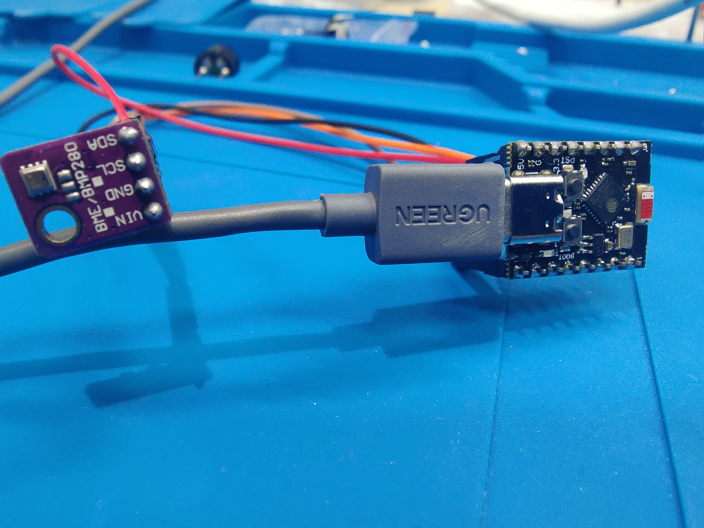
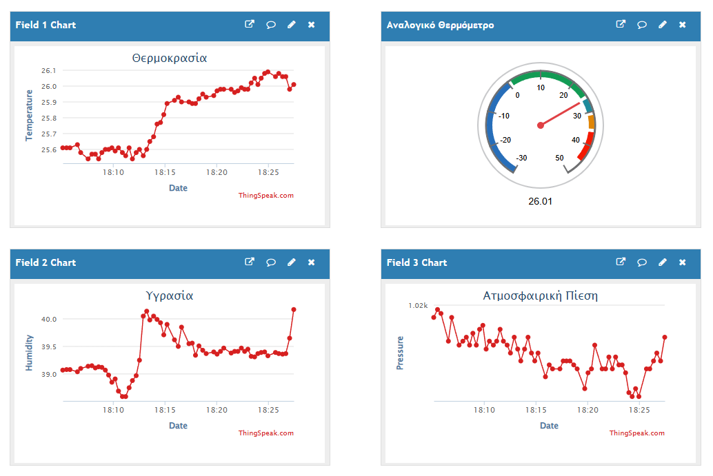

# 12 — ESP Mini Weather Station ThingSpeak

📁 **Φάκελος:** `12_ESP_mini_weather-station-thingspeak/`

---

# Α. Προεπισκόπηση

<p align="center">
  
  
  <br>
  <em>Ολοκληρωμένη κατασκευή στον Σύλλογο Τεχνολογίας Θράκης</em>
  <br>
  <em>Ομάδα Κατασκευής: Άρης Τ., Γιάννης Γ.</em>
</p>

---

# Β. Περιγραφή

Το project χρησιμοποιεί ένα **ESP32-C3 Super Mini** και έναν αισθητήρα **BME280** για τη μέτρηση:

- 🌡️ Θερμοκρασίας
- 💧 Υγρασίας
- 🌤️ Ατμοσφαιρικής Πίεσης

Τα δεδομένα αποστέλλονται μέσω WiFi στο **ThingSpeak**, όπου αποθηκεύονται και προβάλλονται σε γραφήματα και widgets dashboard.

Μετά την αποστολή των δεδομένων το ESP32 εισέρχεται σε **Deep Sleep** για 15 δευτερόλεπτα ώστε να μειώνεται η κατανάλωση ενέργειας.

---

# Γ. Υλικά

| Υλικό | Ποσότητα |
|---------|---------|
| ESP32-C3 Super Mini | 1 |
| BME280 Sensor | 1 |
| Jumper Wires | 4 |
| USB Cable | 1 |

---

# Δ. Συνδεσμολογία

| BME280 | ESP32-C3 Super Mini |
|---------|---------|
| VCC | 3.3V |
| GND | GND |
| SDA | GPIO4 |
| SCL | GPIO5 |

---

# Ε. Βιβλιοθήκες

Εγκαταστήστε μέσω Arduino IDE:

```text
Adafruit BME280 Library
Adafruit Unified Sensor
```

Χρησιμοποιούνται επίσης:

```cpp
#include <WiFi.h>
#include <HTTPClient.h>
#include <Wire.h>
#include <Adafruit_Sensor.h>
#include <Adafruit_BME280.h>
```

---

# ΣΤ. Ρύθμιση ThingSpeak

Δημιουργήστε ένα νέο Channel στο ThingSpeak και ενεργοποιήστε:

| Field | Περιγραφή |
|---------|---------|
| Field 1 | Temperature |
| Field 2 | Humidity |
| Field 3 | Pressure |

Στον κώδικα συμπληρώστε:

```cpp
const char* ssid = "YOUR_WIFI_NAME";
const char* password = "YOUR_WIFI_PASSWORD";

String apiKey = "YOUR_THINGSPEAK_WRITE_API_KEY";
```

---

# Ζ. Τρόπος Λειτουργίας

1. Εκκίνηση ESP32
2. Ανάγνωση δεδομένων από BME280
3. Σύνδεση στο WiFi
4. Αποστολή δεδομένων στο ThingSpeak
5. Αποσύνδεση από το WiFi
6. Deep Sleep για 15 δευτερόλεπτα
7. Επανεκκίνηση και επανάληψη

---

# Η. Παράδειγμα Request

```text
https://api.thingspeak.com/update?api_key=XXXXXXXX
&field1=24.5
&field2=58.2
&field3=1014.3
```

---

# Θ. Deep Sleep

```cpp
esp_sleep_enable_timer_wakeup(15ULL * 1000000ULL);
esp_deep_sleep_start();
```

Το ESP32 ενεργοποιείται μόνο για λίγα δευτερόλεπτα, πραγματοποιεί μέτρηση και αποστολή δεδομένων και στη συνέχεια επιστρέφει σε κατάσταση χαμηλής κατανάλωσης.

---

## Technology Club of Thrace

Educational IoT project using ESP32, BME280 and ThingSpeak.