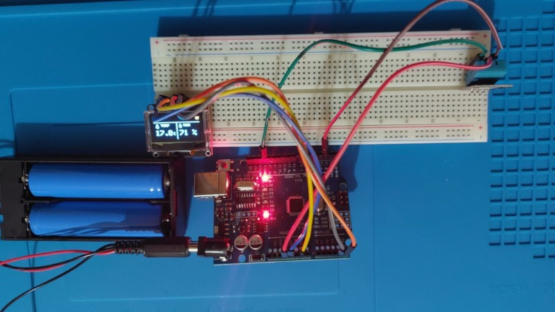

# Arduino Mini Projects

Μικρά εκπαιδευτικά Arduino projects σχεδιασμένα για αρχάριους, σχολικά εργαστήρια και μικρά demos με αισθητήρες, οθόνες και robot kits.  Στόχος του repository είναι η απλή, κατανοητή και πρακτική εισαγωγή στον προγραμματισμό μικροελεγκτών μέσα από έτοιμα αλλά επεκτάσιμα παραδείγματα στην Ελληνική γλώσσα.

## Projects

---

### 01 — OLED DHT11 Mini Dashboard

📁 Φάκελος: `01_oled_dht11_dashboard/`

Ένα Arduino project για αρχάριους που υλοποιεί ένα απλό περιβαλλοντικό dashboard σε OLED οθόνη.

#### Α. Βασικές λειτουργίες:
- OLED SSD1306 128x64 (I2C)
- Ανάγνωση θερμοκρασίας και υγρασίας από DHT11
- Εμφάνιση:
  - Scrolling τίτλου στην πάνω μπάρα
  - Θερμοκρασίας (με 1 δεκαδικό)
  - Υγρασίας (%)
  - Εικονιδίων (θερμόμετρο & σταγόνα)

#### Β. Εκπαιδευτική αξία:
- Χρήση αισθητήρων (DHT11)
- Διαχείριση οθόνης OLED
- **Μη μπλοκαριστικός κώδικας** με `millis()` αντί για `delay()`
- Βασική δομή dashboard UI σε embedded περιβάλλον

#### Γ. Αρχεία:
- `oled_dht11_dashboard.ino`
- `README.md`

---

### 02 — Hosyond 4WD Master (Teacher Edition)

📁 Φάκελος: `02_hosyond_4wd_master/`

Ένα ολοκληρωμένο εκπαιδευτικό project για Arduino βασισμένο σε 4WD robot car kit, σχεδιασμένο για εργαστηριακή χρήση και επίδειξη βασικών εννοιών ρομποτικής.

#### Α. Βασικές λειτουργίες:
**1. MANUAL CONTROL**
- IR Remote
- Bluetooth
- Serial Monitor

**2. LINE TRACKING**
- 3 αισθητήρες γραμμής
- βασική αυτόνομη πλοήγηση

**3. OBSTACLE AVOIDANCE**
- Ultrasonic sensor + Servo
- περιβαλλοντική σάρωση (scan)
- **fail-safe λογική** ώστε το όχημα να μη κινείται “στα τυφλά”

#### Β. Εκπαιδευτική αξία:
- Συνδυασμός πολλαπλών εισόδων (IR, Bluetooth, αισθητήρες)
- Εισαγωγή σε autonomous behavior
- State-based προγραμματισμός (modes)
- Ανάπτυξη λογικής αποφυγής εμποδίων

#### Γ. Αρχεία:
- `Hosyond_4wd_Master_TeacherEdition.ino`
- `README.md`

---

### 03 — LoRa SX1278 με DS18B20

📁 Φάκελος: `03_lora_module_with_ds18b20/`

Project ασύρματης τηλεμετρίας που μεταδίδει θερμοκρασία σε μεγάλες αποστάσεις, με transmitter/receiver αρχιτεκτονική βασισμένη σε LoRa modules SX1278.

#### Α. Βασικές λειτουργίες:
- Μετάδοση θερμοκρασίας με LoRa στα 434MHz
- Ανάγνωση αισθητήρα DS18B20 στον transmitter
- Επικοινωνία transmitter/receiver με αξιόπιστο packet flow
- Εύκολη προσαρμογή για απλά sensor telemetry σενάρια

#### Β. Εκπαιδευτική αξία:
- Εισαγωγή σε LoRa δικτύωση χαμηλής ισχύος
- Πρακτική χρήση SPI περιφερειακών στο Arduino
- Συνδυασμός ασύρματης επικοινωνίας και αισθητήρων θερμοκρασίας
- Κατανόηση βασικών εννοιών embedded telemetry

#### Γ. Αρχεία:
- `src/transmitter/transmitter.ino`
- `src/receiver/receiver.ino`
- `README.md`

---

### 04 — Brent Crude Oil Live Tracker (ESP32-C3)

📁 Φάκελος: `04_oil_price_tracker/`

IoT project με ESP32-C3 που συνδέεται σε WiFi, αντλεί live δεδομένα τιμής πετρελαίου Brent από API και τα εμφανίζει σε OLED οθόνη.

#### Α. Βασικές λειτουργίες:
- WiFi σύνδεση και HTTP κλήσεις σε εξωτερικό API
- Ανάλυση JSON απόκρισης
- Προβολή τιμής και τάσης (up/down) σε OLED 128x64
- Ευέλικτη δομή για αλλαγή ή επέκταση data source

#### Β. Εκπαιδευτική αξία:
- Εισαγωγή σε IoT ροές δεδομένων πραγματικού χρόνου
- Πρακτική χρήση `HTTPClient` και `ArduinoJSON`
- Απεικόνιση δεδομένων σε embedded display
- Σχεδιασμός modular λογικής για API-based projects

#### Γ. Αρχεία:
- `ESP32-C3-Supermini-OilTerminal.ino`
- `README.md`

---

### 06 — R2inoD2ino (Voice Robot)

📁 Φάκελος: `06 R2inoD2ino/`

Δημιουργικό Arduino robot που συνδυάζει voice recognition, ήχο, κίνηση servo και LED feedback μέσα σε χειροποίητο papercraft σώμα.

#### Α. Βασικές λειτουργίες:
- Υποστήριξη έως 17 custom φωνητικών εντολών
- Απόκριση με ήχο + servo + LED μέσω `switch case`
- Idle mode με τυχαίους ήχους αναμονής
- Συνδυασμός hardware integration και θεματικού design

#### Β. Εκπαιδευτική αξία:
- Ενοποίηση πολλών modules (voice, audio, servo, LED)
- Βασικές αρχές event-based λογικής σε Arduino
- Εξοικείωση με περιορισμούς `delay()` σε σύνθετα flows
- Σταδιακή μετάβαση σε non-blocking λογική με `millis()`

#### Γ. Αρχεία:
- `R2D2.ino`
- `README.md`

---